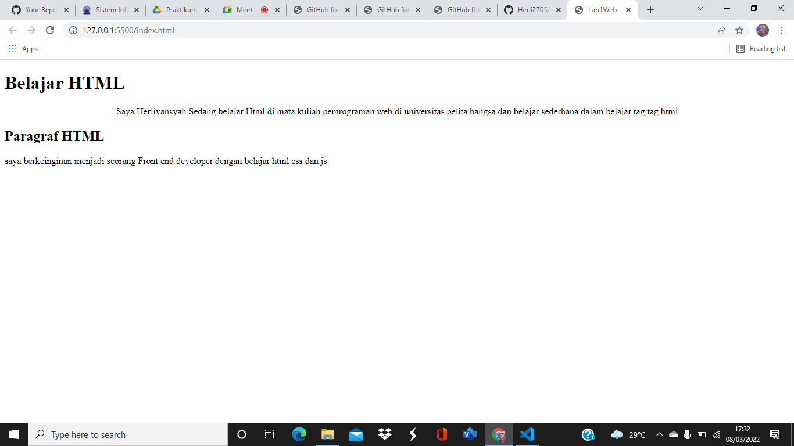
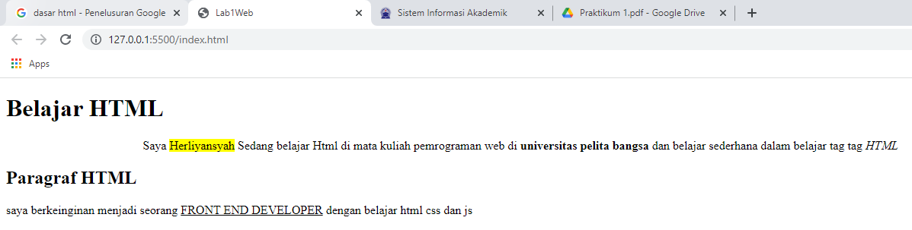
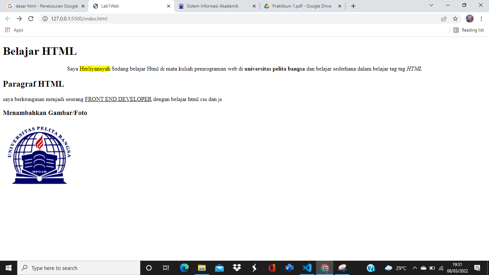
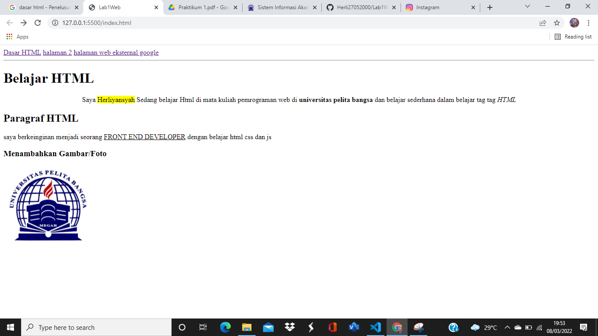

# Tugas LAB 1 Web
## Paragraf

Paragraf memiliki tag yaitu (p) di dalam tag juga kita bisa menambahkan style seperti warna dan format teks

## Heading

Heading adalah judul artikel Heading terbesar yaitu (h1) dan seterus nya akan kecil,namun yang biasa digunakan yaitu (h1) atau (h2)

## Format teks

ini adalah contoh dari format teks,seperti memberi span background-color yellow,dan juga teks tebal bold (b) teks italic dan juga tag underline bergaris bawah

## Menambahkan foto dengan tag IMG

untuk menambahkan foto menggunakan tag img dan ditaruh folder yang sesui untuk source tersebut

## Menambahkan link

jadi ini adalah contoh bagaimana hasil menambahkan link pada tag HTML yaitu a herf dan hasil nya sebagai berikut
